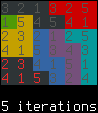

# [Suguru](http://krazydad.com/suguru) Solver

by trosh

Coded in *ugly ugly C*© <3 <3

## building

running `make` inside the main directory should build
a `suguru` executable.

## usage

    ./suguru FILE.sgr

for example, `./suguru grids/s_v1_b16_3.sgr`

## notes

currently works with pretty simple grids.

the process is relatively simple:
the program loads the grid from a `.sgr` file,
then iterates through {values, regions} passes.

- *values passes* go through each cell in row major order,
affects neighbour cells' possibilities,
then do a second pass to find cells with only one
possibility left.
- *regions passes* go through each regions to remove
possibilities according to completed cells within the region,
search for possibilities that appear in only one cell,
then search for single cells outside of region that touch
every cell within region for each possibility.

The storage is relatively compressed, since the
same full grid is used to store possibilities and
final values: in each cell,
- if a value is positive, it is worth the final value
- otherwise its 5 lowest bits describe possibilities.

This should be implemented with a

    union cell {
        signed char final_value;
        struct {
            unsigned char one       : 1;
            unsigned char two       : 1;
            unsigned char three     : 1;
            unsigned char four      : 1;
            unsigned char five      : 1;
            char filler             : 2;
            unsigned char not_final : 1;
        } choices;
    };

maybe, but it is currently implemented as a `char`,
with binary operations implemented manually.

## todo

- comment comment comment
- split functions way more
- split into files
- split regions when n possibilities are placed in the same n cells
- encapsulate iterator
- determine blocked iterations (not just winning iterations)
- do guesswork :-)
  - do 1-level guesswork
  - do a tree-based guesswork :-O (bruteforce) !!
- add user options

